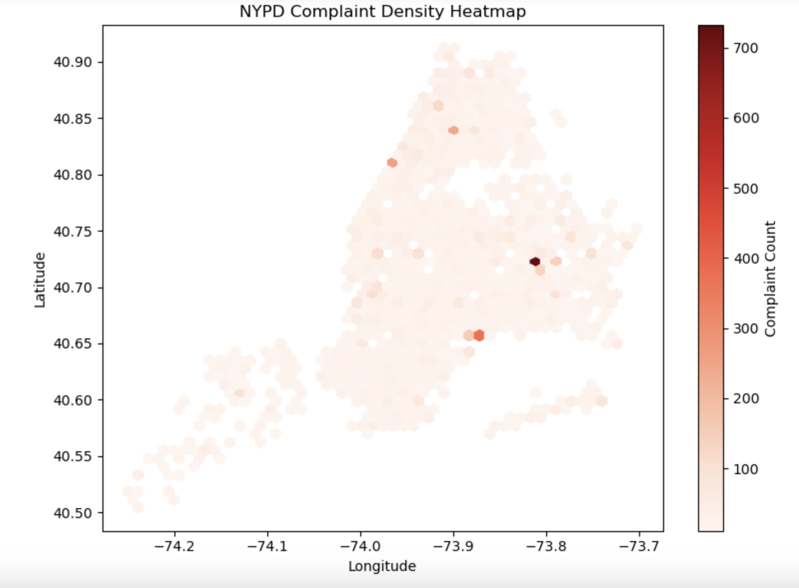

# NYC 311 Complaints: End-to-End Data Pipeline & Hotspot Prediction

This project builds a complete data science workflow using NYC's 311 service request data—from API ingestion to MySQL storage, exploratory analysis, and predictive modeling to forecast complaint hotspots.

---

## 📁 Project Structure

```

.
├── \_config.yml                 # Configuration for GitHub Pages
├── db\_etl/                     # Scripts and notebooks for DB setup and ingestion
│   ├── alter\_database.py
│   ├── create\_db.ipynb
│   ├── ingest\_311\_data.py
│   ├── insert\_data.ipynb
│   └── setup\_database.py
├── EDA/
│   └── 311\_EDA\_SQL.ipynb       # SQL-based exploratory data analysis
├── ML\_Models/
│   └── NYPD\_311\_HotSpotPrediction-2.ipynb  # Final model with feature engineering
├── NYPD\_311\_HotSpotPrediction.ipynb        # Baseline ML model
├── index.md                    # Full documentation (this file)
└── README.md                   # Project overview

```

---

## 1️⃣ Data Ingestion and Storage (`db_etl/`)

We use the NYC Open Data API to collect service requests and store them in a MySQL database.

- `setup_database.py` – Initializes the database schema.
- `ingest_311_data.py` – Queries the Socrata API and saves results locally.
- `insert_data.ipynb` – Cleans and inserts the data into MySQL.
- `.env` file stores sensitive credentials (MySQL & API keys) securely.

> ✅ **Tip**: Be sure `.env` is listed in your `.gitignore` to avoid exposing credentials.

**Sample Table Schema Diagram**  


---

## 2️⃣ Exploratory Data Analysis (`EDA/`)

Notebook: `311_EDA_SQL.ipynb`

Using SQL queries and Python visualizations to understand complaint patterns:

- Top complaint types by borough
- Complaint volumes by hour/day
- Heatmaps of complaint density

**Complaint Heatmap**  


**Complaints by Hour**  


---

## 3️⃣ Predictive Modeling (`ML_Models/`)

We predict whether a given geographic hexagon (H3 index) will become a future complaint hotspot.

### Method:
- Spatial aggregation with [H3](https://h3geo.org/) (resolution 7)
- Grouped by hex and day
- Labeled based on complaint count thresholds

### Notebooks:
- `NYPD_311_HotSpotPrediction.ipynb` – Baseline logistic regression
- `NYPD_311_HotSpotPrediction-2.ipynb` – Adds feature engineering and a random forest model

### Model Comparison:

| Model                    | Precision | Recall | F1 Score | ROC AUC |
|--------------------------|-----------|--------|----------|---------|
| Logistic Regression (v1) | 0.62      | 0.60   | 0.61     | 0.92    |
| Logistic Regression (v2) | 0.64      | 0.67   | 0.65     | 0.94    |
| Random Forest            | 0.78      | 0.63   | 0.70     | 0.96    |

## Predicted Hotspots Visualization

Below is an example visualization showing the predicted 311 complaint hotspots across NYC. The heatmap highlights areas with the highest likelihood of complaint clusters, based on the model's predictions.


---

## 🔒 Security: API & DB Credentials

To protect sensitive information:

- Store credentials in a `.env` file:
```

MYSQL\_USER=your\_user
MYSQL\_PASSWORD=your\_password
MYSQL\_HOST=127.0.0.1
MYSQL\_PORT=3306
MYSQL\_DATABASE=open\_data\_311
APP\_TOKEN=your\_app\_token

```
- Load credentials with `python-dotenv` and `os.getenv()`.
- **Do not commit `.env` to version control.**

---

## 🚀 Next Steps

- Add additional features (weather, event data)
- Tune model hyperparameters
- Deploy as an interactive dashboard (e.g., Streamlit or Tableau)
- Automate the pipeline using a scheduler (e.g., Airflow or cron)

---

## 🔗 Resources

- [NYC 311 Open Data Portal](https://data.cityofnewyork.us/)
- [Socrata API Docs](https://dev.socrata.com/)
- [H3 Spatial Indexing](https://h3geo.org/)
- [SQLAlchemy](https://www.sqlalchemy.org/)
- [scikit-learn](https://scikit-learn.org/stable/)

---

*For a high-level overview, see the `README.md`.*

```

Let me know if you want this automatically saved to `index.md`, or if you'd like help generating placeholder `.png` charts to add now.
